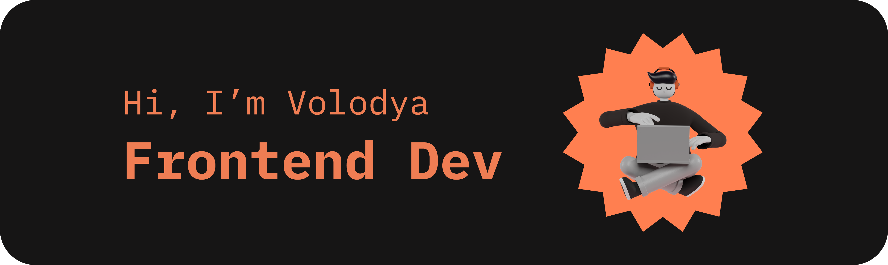

  

- 🔭 I’m currently studying at [Elbrus Bootcamp](https://elbrusboot.camp/)
- 🌱 I’m currently learning PostgreSQL
- 💡 Ask me about anything you like
- ⚡ Fun fact: a cat has 32 muscles in each ear

### 📚 My Skills Stack

Right now I am focusing on frontend development, so here is a list of technologies I use or have some experience with

### 💬 Feel free to contact me

### 😸 Some random joke

