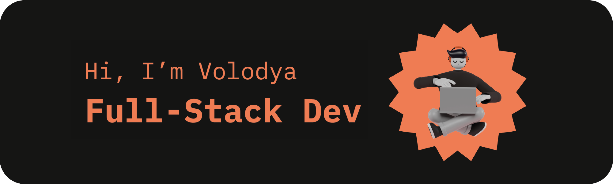

  

- 🚀 I’m actively working on [GeekConsole](https://geekconsole.app/) with my elder brother [Anton](https://github.com/slayoffer/)
- 🌱 I’m currently learning **TypeScript, NextJS**
- 💯 Check out my portfolio website -> https://vladimirevseev.net
- 💡 Ask me about anything you like
- ⚡ Fun fact: a cat has 32 muscles in each ear

### 📚 My Tech Stack

Right now I am focusing on frontend development, so here is a list of technologies I use or have some experience with

### 💬 Feel free to contact me

### 😸 Some random joke

